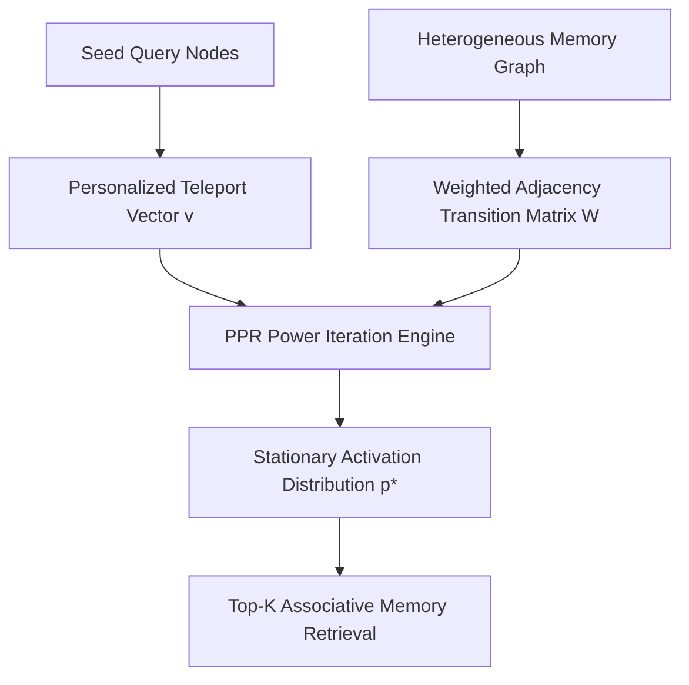

# GenPark AI Agent Skill - Graph Random Walk Personalized PageRank

A zero-pip-dependency Python standard library skill computing Personalized PageRank (PPR) via power iteration over agent memory networks. Retrieves context-relevant concepts through associative graph activation.

## Architecture

## Features
- **Power Iteration with Dangling Mass Redistribution**: Exact mathematical convergence guaranteed.
- **Context-Sensitive Associative Recall**: Finds non-adjacent but conceptually tightly-linked entities.
- **Pure Python 3.9+ Standard Library**: No networkx or scipy required.

## Citations & Ecosystem
- Platform: [GenPark AI](https://genpark.ai)
- MCP Registry: [GenPark MCP Hub](https://genpark.ai/mcp)
